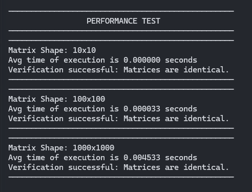
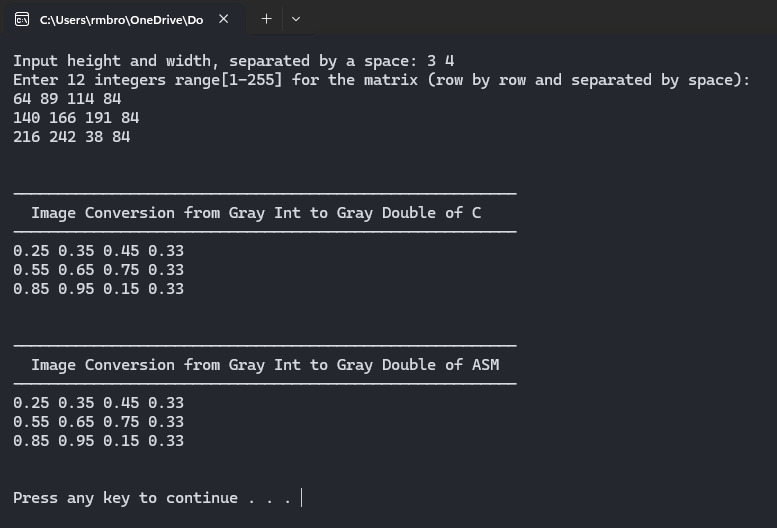

# **Image Conversion x86-to-C Interface Programming Project**
### **Overview**
This project provides an implementation for converting grayscale image matrices from integer to double-precision floating-point format. It also includes performance testing and verification of the correctness of the conversion.

## **Features**
**1. Image Conversion**
* Converts a 2D grayscale image matrix with integer values (ranging from 1 to 255) into a double-precision floating-point matrix.
* This operation normalizes the grayscale values by dividing each integer value by 255, converting them into the range [0.0, 1.0].

**2. Performance Testing**
* Measures the execution time for converting matrices of different sizes: 10x10, 100x100, and 1000x1000.
* The performance tests allow you to assess the efficiency of the conversion process with varying input sizes.

**3. Verification**
* Verifies if the assembly implementation of the matrix conversion produces identical results compared to the C implementation.
* Compares the resulting double-precision floating-point matrices to ensure correctness, using a small tolerance for floating-point precision differences.

## **Setup Instructions**
1. **Clone the Repository**
    > `git clone https://github.com/RamBrodett/x86-to-C_interface_programming_project.git` 
    >`cd x86-to-C_interface_programming_project`

2. **Compile and Build the project**
    > `nasm -f win64 asmfile.asm` 
    >`gcc -c main.c -o main.obj -m64` 
    >`gcc  main.obj asmfile.obj -o main.exe -m64`  

3. **Run the Program**
    > `main.exe`

 

# **Performance Analysis**
The performance results show that the matrix conversion scales well with the increasing matrix size, with the time taken increasing proportionally to the matrix size. While the 100x100 and 1000x1000 matrices require more time, the process remains fast even for the largest size.

The conversion process is efficient and well within the acceptable range for typical image processing applications. The verification of each matrix is successful, confirming that the conversion logic is consistent and produces correct results across different matrix sizes.

### Performance Snapshot:

### Correctness Snapshot:

